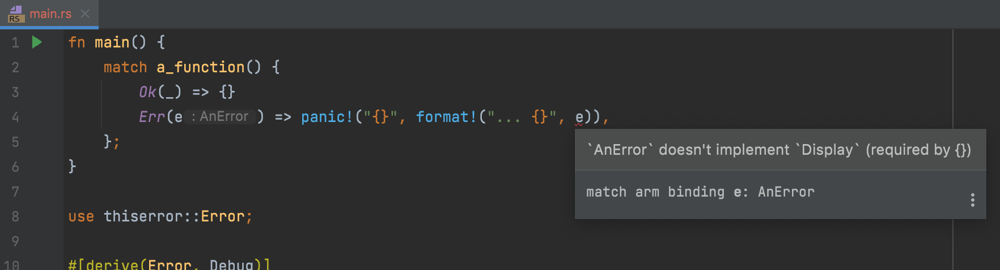
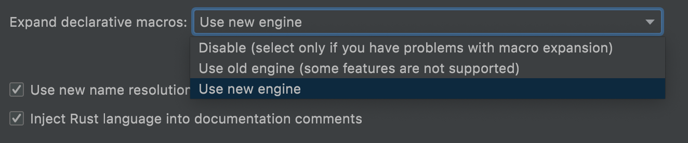

# JetBrain's Rust Macro Expansion

This example repository exists to show an issue with JetBrain's &ldquo;new engine&rdquo; for macro expansions in Rust.

I've verified it in CLion 2021.2.2 (Build #CL-212.5284.51) but I assume it's visible in other products as well via the Rust plugin.

The error appears when trying to pattern match an error that uses `thiserror` macros:

In the example code you'll see that the enum `AnError` derives from `thiserror::Error`.
When matching this type CLion does not pick up on the fact that it does indeed implement `Display`.

There are no errors or warnings when `cargo build`ing this project.

However, Clion does not report this as an issue anymore when switching back to the old macro expansion engine via Settings ->
Languages & Frameworks -> Rust.

My assumption is that it's a regression in the &ldquo;new engine&rdquo; behind it.

## Versions Used

- `cargo 1.56.0 (4ed5d137b 2021-10-04)`
- `rustc 1.56.1 (59eed8a2a 2021-11-01)`
- CLion 2021.2.2, Build #CL-212.5284.51
